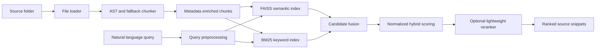

# CodeSeek

**Intelligent code retrieval for large codebases.**

CodeSeek is a local developer tool that turns a natural-language question into ranked, inspectable code snippets. It is built for retrieval: the result is the actual source code, with file paths, symbols, line ranges, and score signals. CodeSeek does not generate an answer with an LLM and does not require an API key.

## Why CodeSeek

Large codebases make simple questions expensive to answer. CodeSeek combines semantic similarity with exact technical vocabulary so a query can find both conceptually related code and precise identifiers such as `validate_token`, `create_connection`, or `JWT`.

## Architecture



## Retrieval pipeline

1. The loader reads supported source files and skips generated directories, binaries, and oversized files.
2. Python AST parsing identifies functions and classes. Other supported languages use brace-aware chunking with a safe line fallback.
3. Every chunk stores its relative path, filename, language, symbol, symbol type, line range, content hash, and code.
4. The embedder creates normalized CPU vectors for FAISS cosine-style search.
5. BM25 indexes paths, identifiers, language, symbols, and code while preserving snake_case and camelCase terms.
6. The query processor extracts programming terms and technical identifiers without an LLM.
7. Semantic and keyword candidates are merged and normalized before configurable score fusion:

   `hybrid_score = alpha × semantic_score + (1 - alpha) × bm25_score`

8. An optional deterministic lexical reranker can refine the candidate order without adding a heavy model dependency.

## Quick start

Requires Python 3.10+.

```powershell
python -m venv .venv
.venv\Scripts\activate
python -m pip install -r requirements.txt
python scripts/build_index.py --path .\data\sample_code
python run.py
```

Open `http://127.0.0.1:8000` and use the CodeSeek dashboard. Enter any accessible source-code folder, build the index, and search. The index is saved under `data/index/` and can be rebuilt whenever the code changes.

If the embedding model cannot be downloaded, use the local fallback:

```powershell
$env:ACI_OFFLINE_FALLBACK='1'
python scripts/build_index.py --path .\data\sample_code
```

The fallback keeps the complete pipeline usable offline but is less capable than `BAAI/bge-small-en-v1.5`.

## Reproducible Docker setup

Docker is the most consistent way to run the application across machines:

```powershell
docker compose build
docker compose up -d
```

Open `http://localhost:8000`, then build the index from `/app/data/sample_code`. The compose file persists the generated index in the `codeseek-index` volume and mounts the sample source read-only. To stop the service:

```powershell
docker compose down
```

The first index build downloads `BAAI/bge-small-en-v1.5` inside the container when network access is available. For an offline demo, build with `ACI_OFFLINE_FALLBACK=1` in the container environment.

## CLI

```powershell
python scripts/search_cli.py "Where is authentication handled?" --top-k 5
```

## API

Build an index:

```http
POST /api/build
Content-Type: application/json

{"path":"./data/sample_code"}
```

Search through either `POST /api/search` or `POST /search`:

```json
{
  "query": "Where is JWT token validation performed?",
  "top_k": 5,
  "alpha": 0.7,
  "rerank": false,
  "candidate_pool": 30
}
```

Each result includes `rank`, `file_path`, `file_name`, `language`, `symbol_name`, `symbol_type`, `start_line`, `end_line`, `code`, `semantic_score`, `bm25_score`, `hybrid_score`, and an optional `rerank_score`. The response also reports candidate counts, preprocessing output, and semantic/BM25/reranking latency.

`GET /stats` reports indexed files, chunks, embedding dimension, FAISS readiness, BM25 readiness, reranker availability, creation time, and supported languages.

## Dashboard

The UI includes:

- Codebase path and one-click rebuild.
- Index health for FAISS, BM25, and reranking.
- Example queries and `Ctrl+Enter` search submission.
- Semantic-weight, candidate-pool, top-K, and reranking controls.
- Ranked cards with score breakdowns, line ranges, and copy-to-clipboard.
- Empty, loading, and error states suitable for demos and review.

## Project layout

```text
app/
  ingestion/       file loading and code chunking
  retrieval/       embeddings, FAISS, BM25, query processing, fusion
  models/           API schemas
  main.py           FastAPI application
data/sample_code/  demonstration codebase
scripts/            build-index and search CLIs
static/             CodeSeek dashboard
tests/              chunking, retrieval, BM25, and API tests
```

## Tests

```powershell
python -m pytest
```

The test suite covers source loading, Python and fallback chunking, query preprocessing, BM25 ranking, API validation, persisted hybrid indexes, and end-to-end search behavior.

## Submission reproducibility

The submission pack is in `docs/submission/`. It contains the six-minute demo script, presentation outline, artifact checklist, and the exact commands used to reproduce the application. The final judged source snapshot is tagged `PRISM_GENAI_HACKATHON_Y2026`. The repository contains source, setup, documentation, tests, sample data, and evaluation assets; the finished PPT and recorded video remain portal-uploaded presentation media and are explicitly tracked in the checklist.

## Configuration

Environment variables include `ACI_MODEL`, `ACI_INDEX_DIR`, `ACI_MAX_FILE_BYTES`, `ACI_MIN_CHUNK_LINES`, `ACI_MAX_CHUNK_LINES`, `ACI_CHUNK_OVERLAP`, `ACI_RERANK_ENABLED`, and `ACI_OFFLINE_FALLBACK`. Supported source extensions are centralized in `app/config.py`.

## Current scope

### Evaluation

Run the local development benchmark after building an index:

```powershell
python scripts/evaluate.py --top-k 10
```

The report compares semantic-only, BM25-only, hybrid, and hybrid plus reranker strategies using the ten queries in `data/evaluation/sample_queries.json`. It reports real `NDCG@10`, `MRR`, query count, and measured evaluation latency. These are development measurements, not official CoIR or MTEB results. The dashboard's Evaluation Lab calls the same endpoint and shows `Not evaluated` until it runs.

The official benchmark adapter is prepared behind an optional dependency:

```powershell
python -m pip install mteb
python scripts/evaluate.py --strategy mteb --model BAAI/bge-small-en-v1.5 --output data/evaluation/mteb
```

This invokes the installed MTEB `AppsRetrieval` task when available; it does not fabricate or substitute local metrics.

The scoring formula is deliberately bounded: each candidate-set score is min-max normalized with safe handling for empty and constant lists, then `hybrid_score = alpha * semantic_normalized + (1 - alpha) * bm25_normalized`. The identifier, filename, and symbol signals are factual booleans exposed as metadata; they are not added to the score. Therefore the displayed relevance percentage is always `hybrid_score * 100` and cannot exceed 100%.

Implemented: local indexing, CPU embeddings, FAISS retrieval, BM25 retrieval, hybrid fusion, optional reranking, retrieval diagnostics, and a professional dashboard.

Planned: stronger cross-encoder experiments, query classification, hybrid evaluation against CoIR, code-version retrieval, evolutionary retrieval, and advanced ranking research. Cloud deployment, user accounts, external vector databases, and LLM-generated answers are intentionally outside the current scope.

## License

Add the license that matches your intended hackathon or research distribution before publishing a public release.
