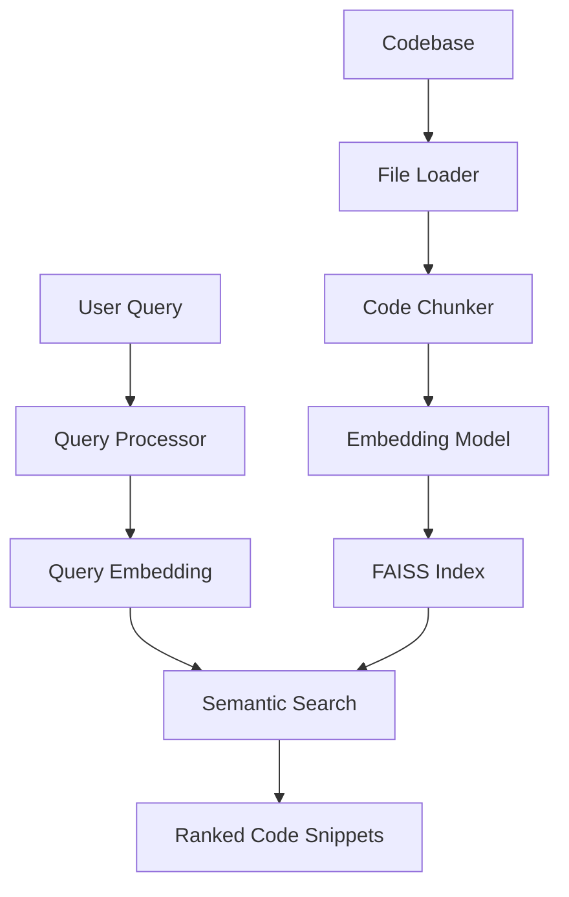

# Agentic Code Intelligence

A local natural language to code retrieval prototype. It indexes real source snippets and ranks them for a query; it does not ask an LLM to generate an answer. The default embedding model is `BAAI/bge-small-en-v1.5`, running on CPU. It downloads on first index/search if it is not cached; afterwards the model and index can be used offline.

## Architecture



The loader skips generated/vendor directories and oversized files. Python functions and classes are identified with `ast`; other languages use brace-delimited blocks, with bounded line windows as fallback. Chunks carry their relative path, symbol, language and inclusive source line numbers. Metadata is prepended to code before embedding. Unit-normalized vectors are stored in FAISS `IndexFlatIP` for cosine similarity; metadata is stored alongside it in JSON. Search loads the cached model/index and embeds only the query.

## Installation

Requires Python 3.10+. On Windows:

```powershell
python -m venv .venv
.venv\Scripts\activate
python -m pip install -r requirements.txt
```

The model is downloaded from Hugging Face on first use. No paid API or key is used. If model downloads are blocked, set `ACI_OFFLINE_FALLBACK=1` to use a deterministic local hashed-token ranker so the complete indexing/search flow can still be tried; this fallback is lexical and less capable than BGE. Build output reports the selected embedding mode.

## Build the index

```bash
python scripts/build_index.py --path ./data/sample_code
```

The index is saved to `data/index/index.faiss` and `data/index/metadata.json`. Re-run the command after source changes.

## Run the application

```bash
python run.py
```

Open http://127.0.0.1:8000. Enter a local folder path, select **Build / Rebuild Index**, and then search. The first model load can take a few minutes. API routes are `POST /api/build`, `POST /api/search`, and `GET /api/status`. Build payload: `{"path":"./data/sample_code"}`. Search payload: `{"query":"Where is authentication handled?","top_k":5}`.

## CLI

```bash
python scripts/search_cli.py "Where is authentication handled?" --top-k 5
```

## Tests

```bash
python -m pytest
```

The tests cover source loading, Python chunking and fallback, the three sample retrieval topics, and basic API behavior. The query ranking test uses lexical overlap to check candidate coverage without downloading a model; run the CLI or UI for semantic embedding retrieval.

## Configuration

Set `ACI_MODEL` to change the sentence-transformers model, `ACI_INDEX_DIR` to relocate index files, and `ACI_MAX_FILE_BYTES` to change the file size cap. Chunk limits can be adjusted with `ACI_MIN_CHUNK_LINES`, `ACI_MAX_CHUNK_LINES`, and `ACI_CHUNK_OVERLAP`. Supported extensions are centralized in `app/config.py`.

## Limitations

This first prototype has no sophisticated reranker, query classifier, hybrid/BM25 retrieval, code-version or evolutionary retrieval, or NDCG/MRR evaluation against CoIR. Brace-based parsing is intentionally approximate, and the local sample tokens/password handling are illustrative only. A local folder path supplied through the UI must be accessible to the server process.
